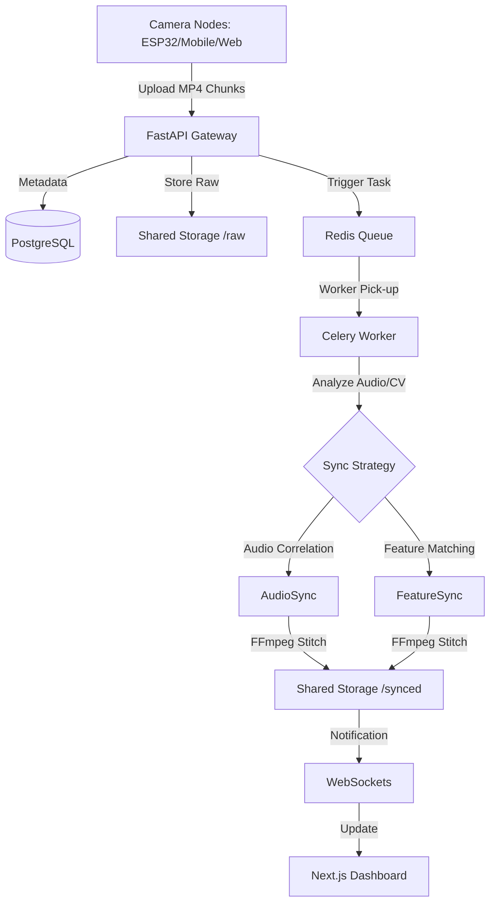

# 🎥 VideoSync Pipeline

> **Multi-Camera Real-Time Video Capture, Synchronization & Processing Platform**

The **VideoSync Pipeline** is an advanced IoT/Cloud platform designed for multi-perspective video capture. It enables multiple devices (mobile phones, ESP32s, or web cams) to record synchronized video chunks, which are then aligned in real-time using audio cross-correlation and visual feature matching.

---

## 🏗 Architecture & Data Flow

### 1. System Overview
The pipeline is designed for high-throughput video ingestion where temporal alignment is critical. It follows a distributed producer-consumer model:



### 2. Synchronization Strategies

| Strategy | Methodology | Use Case |
|---|---|---|
| **Audio-Based** | Uses cross-correlation of audio fingerprints to find sub-second offsets. | Ideal for environments with shared audio (e.g., concerts, speeches). |
| **Feature-Based (CV)** | Analyzes visual landmarks using ORB/SIFT/Fundamental Matrix. | Ideal for silent recordings with overlapping fields of view. |
| **SeSyn-Net (Pose)** | Graph Convolutional Network (GCN) analyzing human keypoints (YOLO11). | Most robust for human-centric activities, even without audio. |
| **Auto (Default)** | Sequential fallback: Audio ➔ CV ➔ SeSyn-Net. | Best for general use; tries the fastest method first. |

### 3. Storage Hierarchy
```text
backend/storage/
├── raw/
│   └── {session_id}/
│       └── chunk_{index}/
│           ├── cam_1.mp4       # Original upload from node A
│           └── cam_2.mp4       # Original upload from node B
├── synced/
│   ├── chunk_{index}_synced.mp4  # Aligned & merged output
│   └── session_{id}_final.mp4    # Optional concatenated full session
└── temp/                         # Volatile processing artifacts
```

---

## 🛠 Tech Stack

| Layer | Technology | Rationale |
|---|---|---|
| **Frontend** | Next.js 15 | App Router for performant dashboard and real-time state management. |
| **Backend API** | FastAPI | High-performance asynchronous processing for binary uploads. |
| **Task Queue** | Celery + Redis | Decouples heavy video processing from API response times. |
| **Database** | PostgreSQL | Relational storage for session metadata and device states. |
| **Video Engine** | FFmpeg + OpenCV | Industry-standard tools for video manipulation and CV analysis. |

---

## 🚀 Quick Start

### 1. Prerequisites
- **Docker & Docker Compose** (Desktop/Engine)
- **FFmpeg** (Optional: only needed for local CLI testing)

### 2. Environment Setup
```bash
# Clone the repository
git clone https://github.com/teobun/sync_video_pipeline.git
cd sync_video_pipeline

# Create your environment file
cp .env.example .env
```
*Note: The `.env` file contains sensitive keys like `DATABASE_URL` and `SECRET_KEY`. Ensure these are rotated for production.*

### 3. Launching the Services

The easiest way to start is using the provided **Makefile**:

```bash
# Initialize and start everything (Local)
make up

# Expose to the internet (optional)
# This will start a Cloudflare tunnel and update the dashboard with the public URL
make tunnel
```

**Access Points:**
- **Dashboard**: `http://localhost:3000` (or the URL provided by `make tunnel`)
- **API Docs**: `http://localhost:8000/docs` — Full Swagger/OpenAPI specification.
- **Reverse Proxy**: `http://localhost:80` — Nginx entry point.

### 4. Advanced Sync Setup (SeSyn-Net)

To use the **SeSyn-Net (Pose-based)** synchronization strategy, you must provide pre-trained model weights. 

1. The system will automatically clone the `Sync-Camera` repository into `backend/app/services/sesyn_net_approach/Sync-Camera` on the first run.
2. Download the `cmu_syn.pth` weights (usually available from the SeSyn-Net repo or research paper).
3. Place the weights at:
   `backend/app/services/sesyn_net_approach/Sync-Camera/SeSyn-Net-main/model/cmu_syn.pth`

*If weights are missing, the system will gracefully skip this method and use Audio or Feature-based sync.*

---

## 📱 Operational Guide

### Recording Workflow
1.  **Initialize**: Create a new session on the Dashboard.
2.  **Connect**: Open the camera URL on target devices. They will register with the `session_id`.
3.  **Capture**: Trigger "Start" from the dashboard. Cameras will record synchronized increments.
4.  **Process**: Workers automatically pick up chunks as they complete the "full-set" requirement.
5.  **Monitor**: View real-time logs via `docker compose logs -f worker`.

---

## 🌐 Local & Remote Access

The system is designed to work in three modes:

### 1. Local Development (localhost)
- **Dashboard**: `http://localhost:3000`
- **Camera**: `http://localhost:3000/camera`
- *Note*: `localhost` is considered a "Secure Context" by browsers, so camera access and WebSockets will work without HTTPS.

### 2. Local Network (IP Address)
- **Dashboard**: `http://192.168.x.x:3000`
- **Camera**: `http://192.168.x.x:3000/camera`
- **⚠️ IMPORTANT**: Modern browsers (Chrome/Safari) **block camera access** on non-localhost HTTP addresses. 
- To use mobile devices on your local network, you **must** use the Cloudflare Tunnel (`make tunnel`) to get an `https://` URL.

### 3. Remote Access (Cloudflare Tunnel)
- **Command**: `make tunnel`
- **URL**: `https://{random}.trycloudflare.com`
- This provides a secure HTTPS connection, which is **required** for iOS/Android camera nodes to function.

---

## 🛠 Troubleshooting & Maintenance

### Connectivity Issues
- **"Not Connected" on Camera**: 
    - Ensure the backend container is running (`docker compose ps`).
    - If using port 3000, ensure port 8000 is also open.
    - Check for "Mixed Content" warnings in the browser console.
- **Manual Reconnect**: Use the **"RECONNECT NOW"** button on the camera page if the connection drops.
- **iOS Safari**: Requires HTTPS. Use the tunnel URL. Also, ensure you have clicked "Allow" for camera permissions in Safari settings.

### Processing Issues
- **Alignment Drift**: Ensure NTP synchronization on all capture nodes if possible.
- **Processing Backlog**: Increase Celery concurrency in `docker-compose.yml` if uploads exceed processing speed.
- **Clean Start**: To wipe all data and start fresh:
  ```bash
  docker compose down -v
  rm -rf backend/storage/raw/* backend/storage/synced/*
  ```

---

## 👨‍💻 Project Structure
- `backend/`: Python source code, synchronization services, and background workers.
- `frontend/`: TypeScript/Next.js UI components and state logic.
- `nginx/`: Routing configuration for production parity.
- `.github/`: Automated CI pipelines for linting and testing.

---

## 📄 License
This project is licensed under the MIT License - see the [LICENSE](LICENSE) file for details.
